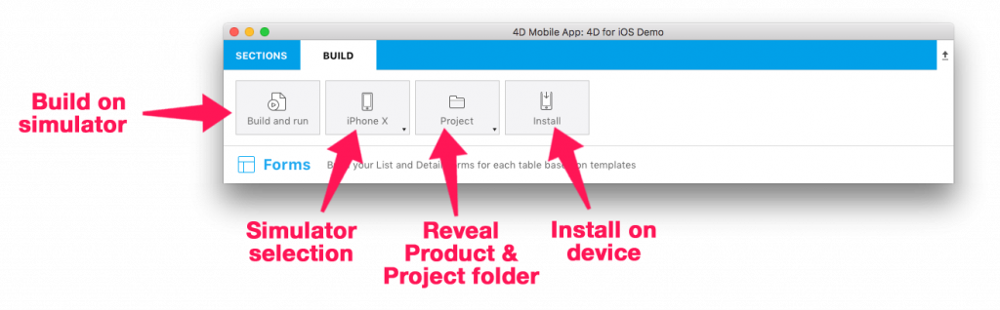

When you're satisfied that your application is ready, you can launch it in the Simulator to test it.

Let’s look at the Build tab options in detail:

* <b>Build and Run:</b> Launches the application in the Simulator.

* <b>iPhone X:</b> The default Simulator. Clicking here will reveal a dropdown list with all available simulators.

* <b>Project:</b> Reveals a dropdown list where you can open the project or product folder, or open the product with Xcode.

* <b>Install:</b> Installs the application on a connected device.
 

Select a Simulator to build and test your application on, and press the <b>Build and Run</b> button.

You're now ready to explore 4D for iOS on your own and build your own iOS project!

