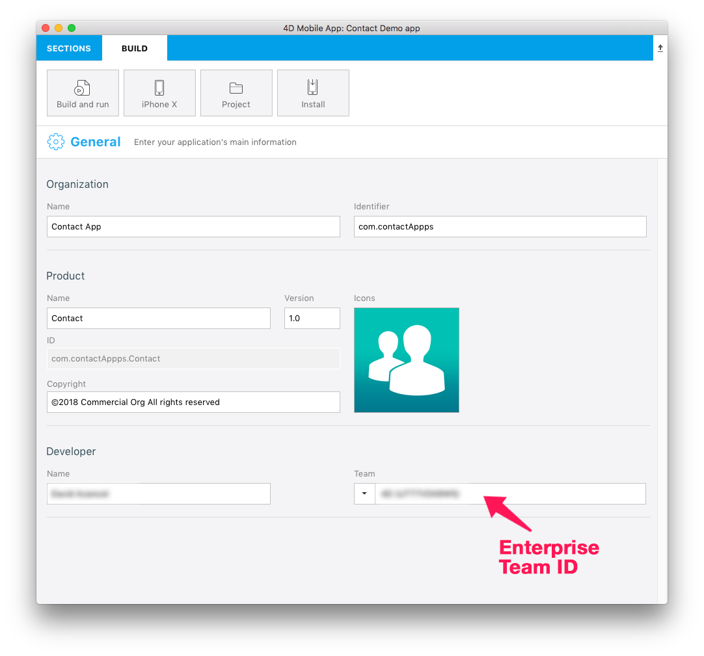

<div class = "objectives">
<b>OBJECTIVES</b>

* Archive and export your iOS Project
* Generate ipa and Manifest file
</div>

<div class = "prerequisites">
<b>PREREQUISITES</b>

* A secured web server
* 57x57 px icon
* 512x512 px icon

</div>

## STEP 1. Xcode configuration

After your account has been validated by Apple, open Xcode and add your Apple Enterprise Developer account in Preferences > Accounts.

Xcode automacally installs required Provisioning and Certificates. 

## STEP 2. Get your Team ID

* Go to Developer Account > Membership and get your Team ID.


## STEP 3. 4D for iOS configuration

* Enter your production URL in Sections > Publising (HTTPS is mandatory for deployment).

* Launch 4D for iOS in Sections > General and enter your Team ID.


 
* Build and Run your Project

## STEP 4. Open your project with Xcode from the Project Editor

* From the Project Editor BUILD tab, click on Project > Open the project with Xcode


## STEP 5. Archive your project from Xcode

* From Xcode go to the simulator Menu and select <b>Generic iOS Device</b>


* Go to Menu > Product and select <b>Archive</b>


## STEP 6. Export your project

* At the end of the archive process the Organizer window appears with the archive you just created

* Clic on the Export Button


## STEP 7. Select your distribution method

* Select <b>Enterprise</b> to distribute to your organisation and clic Next button


## STEP 8. Select your Enterprise distribution options

* You can leave all options boxes checked.


But what is a manifest ?

Basically the manifest is an XML based property list and sould contain :

* <b>URL</b> : URL pointing to the .ipa file.
* <b>display-image</b> : URL pointing to a 57x57 px (72x72 px for iPad) PNG icons used during download and installation
* <b>full-size-image</b> : URL point to a 512x512 px PNG image that represents the iTunes app
* <b>bundle-identifier</b> : your app identifier string. You can get it from your app's plist file.
* <b>bundle-version</b> : the app's current bundle version string. You can get it from your app's plist file.
* <b>title</b> : your application name

Here is an example of a manifest.plist file :

```
<?xml version="1.0" encoding="UTF-8"?>
<!DOCTYPE plist PUBLIC "-//Apple//DTD PLIST 1.0//EN" "http://www.apple.com/DTDs/PropertyList-1.0.dtd">
<plist version="1.0">
<dict>
	<key>items</key>
	<array>
		<dict>
			<key>assets</key>
			<array>
				<dict>
					<key>kind</key>
					<string>software-package</string>
					<key>url</key>
					<string>https://...Contact.ipa</string>
				</dict>
				<dict>
					<key>kind</key>
					<string>display-image</string>
					<key>url</key>
					<string>https://...Contact_icon_57.png</string>
				</dict>
				<dict>
					<key>kind</key>
					<string>full-size-image</string>
					<key>url</key>
					<string>https://...Contact_icon_512.png</string>
				</dict>
			</array>
			<key>metadata</key>
			<dict>
				<key>bundle-identifier</key>
				<string>com.contactApp.ContactDemoapp</string>
				<key>bundle-version</key>
				<string>1.0</string>
				<key>kind</key>
				<string>software</string>
				<key>title</key>
				<string>Contact Demo app</string>
			</dict>
		</dict>
	</array>
</dict>
</plist>
```

* Here you can choose to let Xcode generate a manifest.plist file for you or generate it manually.

* Click Next Button

## STEP 9. Distribution manifest information

* We recommand to let Xcode do the job entering your app url as well as icons' url. You will of course have the option to change those urls later.


* Click Next Button


## STEP 10. Re-sign your application

* Let Xcode manage signing checking the <b>Automatically manage signing</b> option.


* Click Next Button

## STEP 11. Review your App.ipa content

* Here you can check tha your applicaiton identifier is the right one as well as your Team ID.


* Click on <b>Export button</b> and select where you want to save your app folder on your computer to find it easily.


