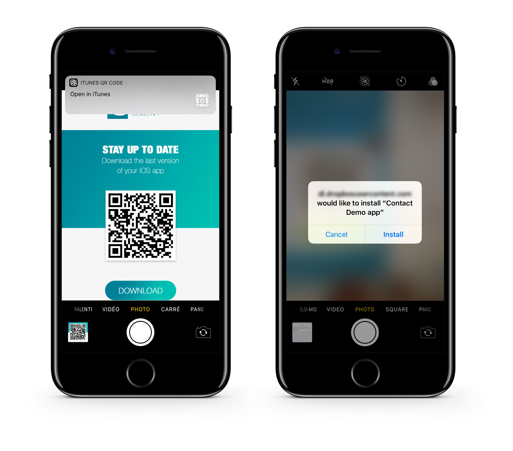

<div class = "objectives">
<b>OBJECTIVES</b>

* Upload your App on a secured server
</div>

## STEP 1. Upload your files to a secured server
* assets (display-image and full-size-image)
* manifest.plist file
* ipa file

Urls must match with url previously defined in your manifest.plist file.

<div class = "tips">
<b>TIP:</b>

You can use any cloud storage service to distribute your app as soon as it is secured (Dropbox, Google Drive...)
</div>


## STEP 2. Create the installation link

* Create an ITMS Serices link (iTUnes Music Store) with the full web address of your manifest file as a parameter :

```
itms-services://?action=download-manifest&url=https://mywebserver.com/manifest.plist

```

* You can send a email that includes that link, embed it in an html page or even create QR code to scan with your iPhone to install your app.

Here a simple example of what can be done :


 <div class = "caution">
<b>CAUTION</b>

Your asset and ipa urls need to match with url that you previously defined in your manifest.plist file.
</div>


<i>The QR Code used for this documentation is not active.</i>

## STEP 3. Install your entreprise app on iOS

* Install the app clicking on the link or in that case scanning a QR Code



* When you first open an enterprise app that you've manually installed, you see a notification that the developer of the app isn't trusted on your device. 

* Dismiss this message and go to Settings > General > Profiles or Profiles & Device Management. Under the "Enterprise App" heading, you see a profile for the developer.


* Tap the name of the developer profile to establish trust for this developer.


* You can then go to your app and open it.

Congratulations you can now distribute in-house your first app !
