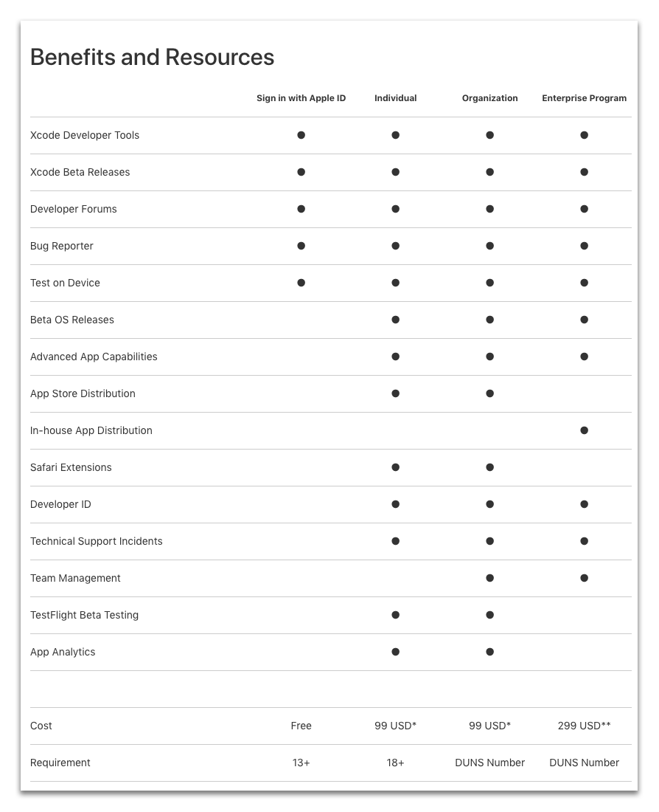

<b>OBJECTIVES</b>

* Choose your Apple Developer Program

You need to have a valid Apple Developer account to <b>distribute an iOS app</b> :

* [Apple Developer Program for organization](register-apple-developer-program-organization.html) or [for individual](register-apple-developer-program-individual.html) – $99/year 
* [Apple Enterprise Developer Program](register-apple-developer-enterprise-program.html) – $299/year

The main difference is that the Apple Developer Enterprise Program provides resources ONLY for developing and distributing <b>proprietary, in-house apps</b> to employees.

On the other hand, the Apple Developer program allows you to distribute your app <b>on the App Store</b>.

For test purposes you can choose to use a [Free Apple Developer Program](free-developer-account.html)

Here is a chart that compares the different levels of developer membership :

