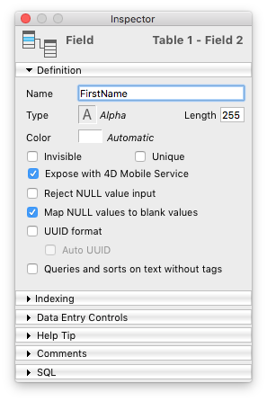
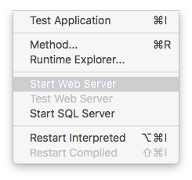

## Software requirements

* 4D Server / 4D Developer 17 R2.
* Mac OS X version 10.13 (or later).
* Latest [Xcode](https://itunes.apple.com/us/app/xcode/id497799835) version installed on your Mac.
* [Apple configurator 2](https://itunes.apple.com/us/app/apple-configurator-2/id1037126344) installed on your Mac (optional). 
Install this software if you want to automate the app installation on your physical device.

## Hardware requirements

* 8GB of RAM (Minimum recommended)

## Configuration

* Tables and Fields must be <b>exposed with 4D Mobile Service</b>. Display the Table Inspector in the Structure editor and select the table you want to modify. By default, the Expose with 4D Mobile Service option is checked.

* Your HTTP and HTTPS ports must be well-configured. HTTPS is mandatory for deployment.

* Your Web Server must be started. It is available from the Run Menu.

