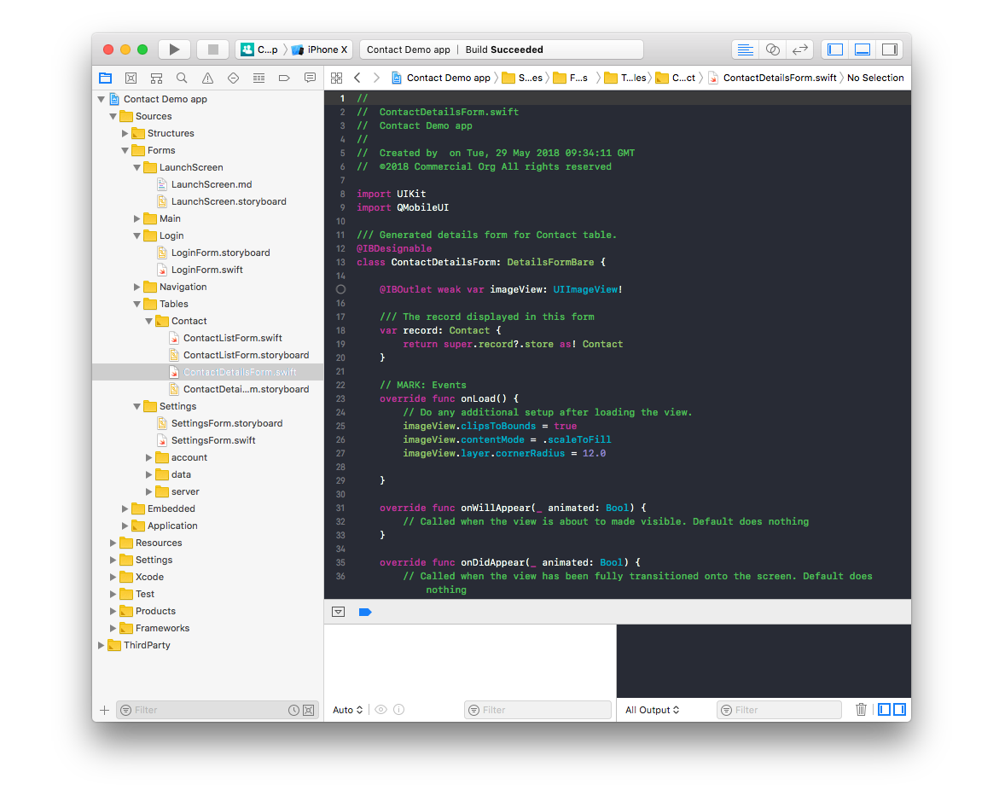
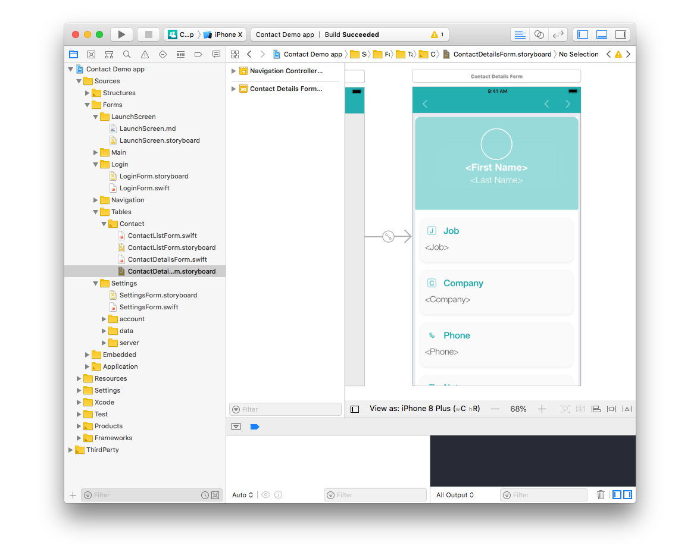

From your project navigator go to Sources > Forms

Here you can find:

* The launchscreen: appears first when you launch your app
* The login screen: appears when authentication is activated
* The setting screen: include the reload action as well as the logout
* All tables that have been published

Those files are generally working by two, except for the launchscreen:
* A swift file: where you can add your custom code

* A storyboard file: where you can customize your app design

Let see how to customize the contact App detail view in a few clics !

