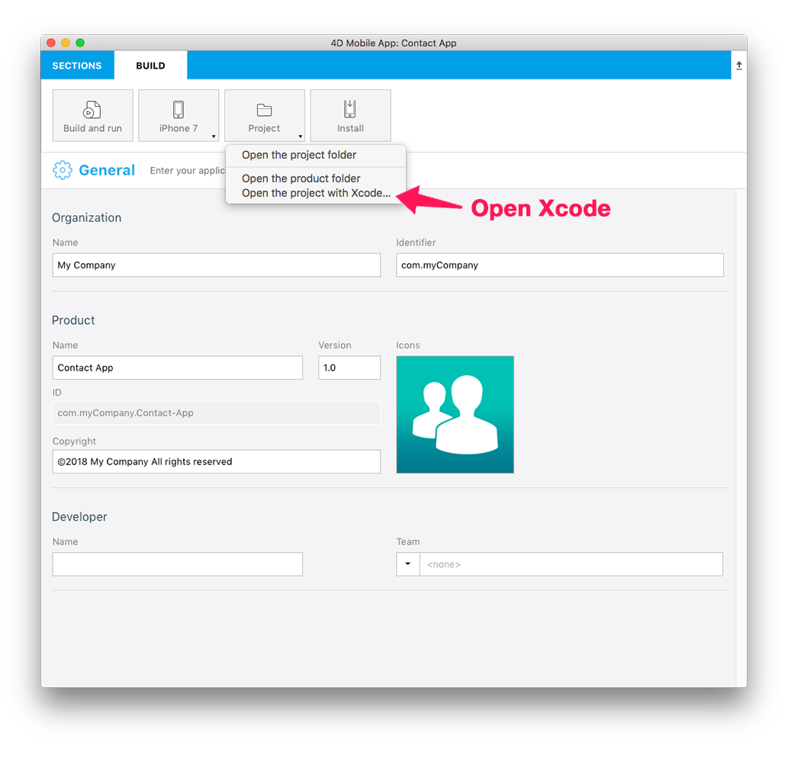

<b>OBJECTIVES</b>

* Open an iOS project from the Project Editor

<b>CAUTION</b>

* If you customize your project on Xcode and Build again from the Project Editor All your modifications will be lost

4D for iOS generates a native iOS app for you and let you modify and customize it right into Xcode. Let's see how to do this !

Let us come back to our Contact app by downloading the starter project !

<a class="button"
href="../assets/OpenYourProjectWithXcode/ContactStarter.zip">STARTER PROJECT</a>

## STEP 1. GENERATE YOUR IOS PROJECT

* If you already have Built your project one time, go to step 3
* If your don't have built your project yet, go to step 2

## STEP2. BUILD YOUR PROJECT

* Click Build and run button From the Project Editor BUILD tab to generate your iOS App.

## STEP 3. OPEN THE PROJECT WITH XCODE

* From the Project Editor BUILD tab, click on Project>Open the project with Xcode

