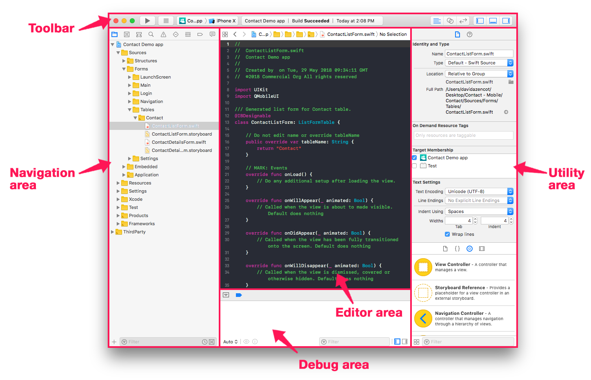
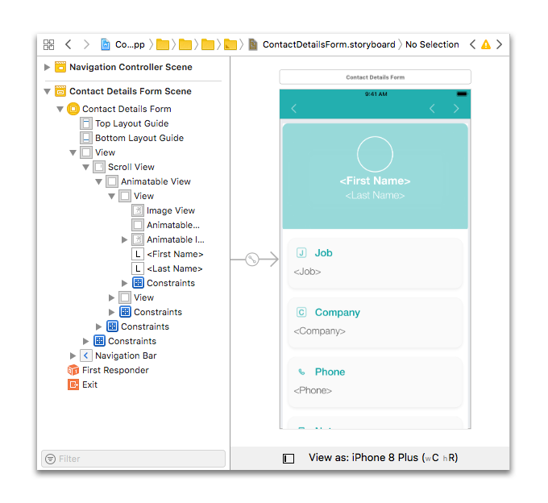
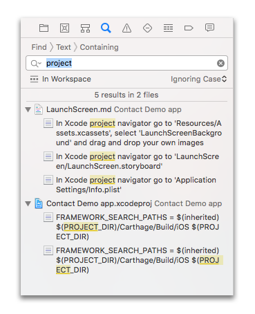

<b>OBJECTIVES</b>

* Have a basic understanding of how to navigate in Xcode

Xcode displays various areas that we are going to pass through :

## The Toolbar

* The buttons at the left are the Build and Stop buttons. Pressing the Run button will build and run your application and launch your app in the selected iOS Simulator. 

* The dropdown menu next the Stop button indicates which build target you want to run and which Simulator you want to build and run your app on

* On the right corner of the toolbar, you can find View buttons to show and hide the various areas

## The Editor area

This area is where all the coding happens when a swift file is selected.
You can notice that the Editor area changes when astoryboard file is selected : the Interface Builder View appears.

## Interface Builder area

The interface builder is a graphical interface to allow you to build your Storyboard or a XIB file. At the left all your scenes are available with all 

## The Utility area

This area inculdes the inspector panel and the Library panel :

* The Inspector panel will give you details about the selected file in your project navigator.
* When you’re using the Interface Builder, you can drag UI elements from the Object Library panel to add that element to your user interface.

## The Debug area
 The area displays outputs and the state of various variables when you run your application.

## The Navigation area
The Navigation area includes several tabs. The most important tabs are :

* The Project navigation tab : includes all files necessary for your application to work properly.

* The Search navigator tab : you can do research in your entire project from this tab

* The Issue navigator tab : shows all error in your iOS project. Red colored errors for the bad ones that you need to correct to build your app and yellow warnings that can lead to issues but are not blocking to build the project. You can click on errors and warnings to visualize them in the project.

Next step, we are going to focus on files included in your iOS project from the Project navigation tab.
