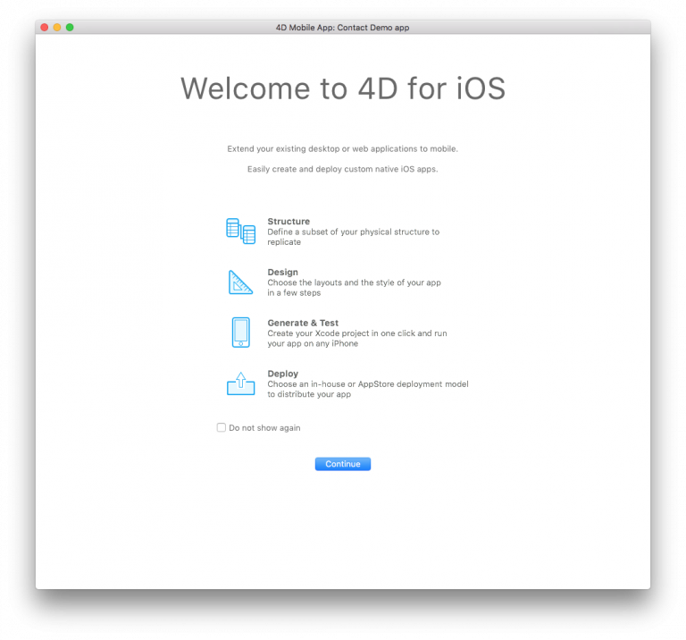

<b>OBJECTIVES</b>

* Get familiar with the Project Editor

<b>PREREQUISITES</b>

* Tables and Fields must be <b>exposed with 4D Mobile Service</b>.
* Your HTTP and HTTPS ports must be well-configured.
* Your Web Server must be started.
* 4D Server / 4D Developer 17 R2.
* Mac OS X version 10.13 (or later).
* Latest [Xcode](https://itunes.apple.com/us/app/xcode/id497799835) version installed on your Mac.

Let's take a look at how 4D for iOS works. Start your 4D application and open your current database. From here, go to <b>New > Mobile Project</b>.

The welcome screen automatically appears to help you understand the basic concepts in 4D for iOS. You can check the <b>Do not show again</b> option and this dialog will no longer be displayed. Click <b>Continue</b>.

Here we are! Now it's time to discover the 4D for iOS architecture and interface.

The main window consists of two tabs:

## Sections

In the Sections tab, you'll find all of the necessary steps to create your 4D for iOS application:

* General
* Structure
* Labels & Icons
* Main Menu
* Forms
* Publishing

## Build

The Build tab has four options:

* Build and Run 
* Simulator selection
* Project and product browser
* Install 
