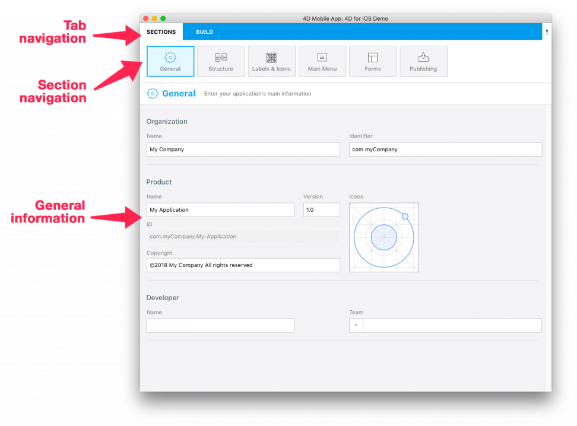

This section allow's you to define your application main information.

* <b>Organization:</b> Enter your company’s name or your personal name.
* <b>Identifier:</b> Enter your organization’s bundle identifier. This will be used to identify your application. The product name you enter is concatenated to create the default “Bundle ID” using reverse domain name service notation. This bundle ID must be unique to your application.
 

For example, if your company’s name is “MyCompany” and your application’s name “MyApp”, you could choose “com.MyCompany” as your company identifier and your App bundle ID will be com.MyCompany.MyApp.

<b>FYI:</b>

Help links are available for the Name and Identifier fields.

 

* <b>Product name:</b> Your application’s name. As described above, the product name is used to create the bundle identifier. This Bundle ID must be the same as the Bundle ID you create in your apple development account.
* <b>Version:</b> The version of your application. Add version numbers in ascending, sequential order starting with 1.0.
* <b>Copyright:</b> The copyright of your application. 4D for iOS suggests a copyright format but you can create your own.
* <b>Icons:</b> 4D for iOS allows you to create application icons in various ways, in accordance with  Apple's guidelines. For example, you can browse or drag and drop your icons directly from your computer to the icon area. 4D for iOS will generate all required formats for you!
 

<b>TIP:</b>

If you already have an icon for your desktop application, you can drag and drop it directly into the icon area. 

Here's the magic trick: 4D for iOS automatically determines the dominant color of your application's icon and uses it to generate a custom color scheme for your application!

* <b>Developer:</b> This field is automatically filled with your user account name.
* <b>Team:</b> Your Developer Account Team ID

