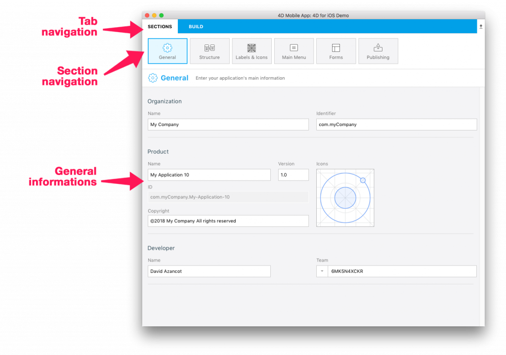

* Organization’s Name: your company’s name or your personal name.
* Organization identifier: your organization’s bundle identifier. will be used to identify your app. The product name you enter are concatenated to create the default “Bundle ID” using reverse domain name service notation. This bundle ID needs to be unique to your app.
 

For example, imagine your company’s name is “MyCompany” and your app’s name “MyApp”, in this case you could choose a company identifier like “com.MyCompany”

<b>TIPS:</b>

Help links are available focusing on Name and Identifier fields for more information about the organization part.

 

* Product name: your new app name. as described above, the product name is used to create the Bundle ID. This bundle ID must be the same as the bundle ID that you create in your apple development account.
* App Version: the version of your app. Here you need to add Version Numbers in ascending sequential order starting with 1.0
* Copyright: the copyright of your app. 4D for iOS suggest a copyright format but you can make your own
* Icons: 4D for iOS allows you to create app icons in various ways with strong Apple guidelines consideration. For instance, you can browse or drag and drop your icon directly from your computer to fill the icon area. 4D for iOS will generate all required formats for you!
 

<b>TIPS:</b>

You probably already have an icon for your desktop app. Good news! You can use it and drag and drop it directly right into the icon area. 

Here the magic trick: 4D for iOS gets the dominant color of your app icon and use it to generate a custom app at your color! Cool right!

* The developer Name: the developer name is automatically filled
* The Team ID: The team ID matches with your Developer Account Team ID

