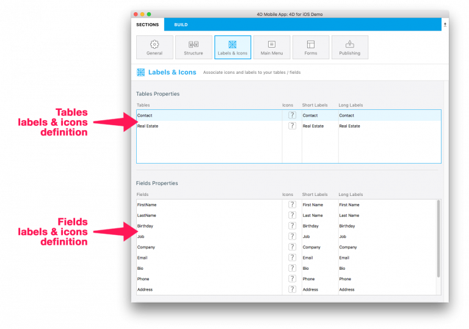

In this part you will be invited to define short and long labels as well as icons for your tables and fields

* Short and long labels : the long and short labels are used depending on the space available in templates. For instance, short label will be used to optimize space and avoid crowded tabbar.
* Icons : 4D for iOS provides a large embedded icons library with many different icons to meet almost all your needs: commerce, finance, education, government, health, industry, Real estate, services…

<b>TIPS:</b>

Nice default icons are generated if at least one icon has been defined for your fields, for the sake of harmonization

You can also leave empty your the icon area if you don’t want to display any icon in your iOS app

