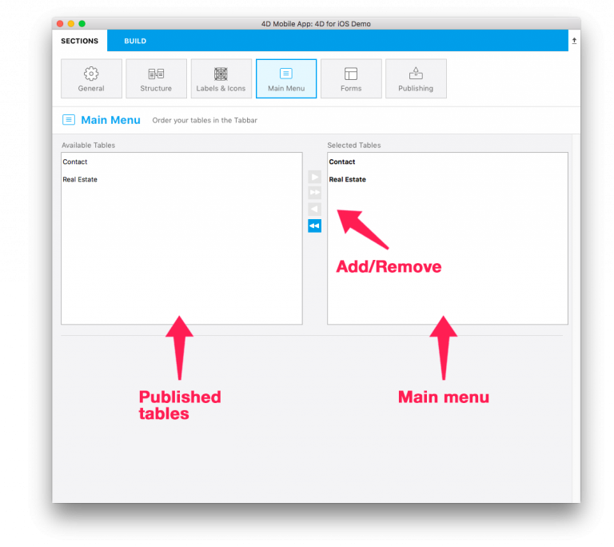

* In the Available Tables list, you'll find all of the tables you published earlier in the Structure section.
The Selected Tables list includes all of tables that will be accessible from the menu of your application.
* By default, all selected tables from the Structure section will be added to your application’s menu. You can then drag and drop to add, delete, and reorder the tables .

