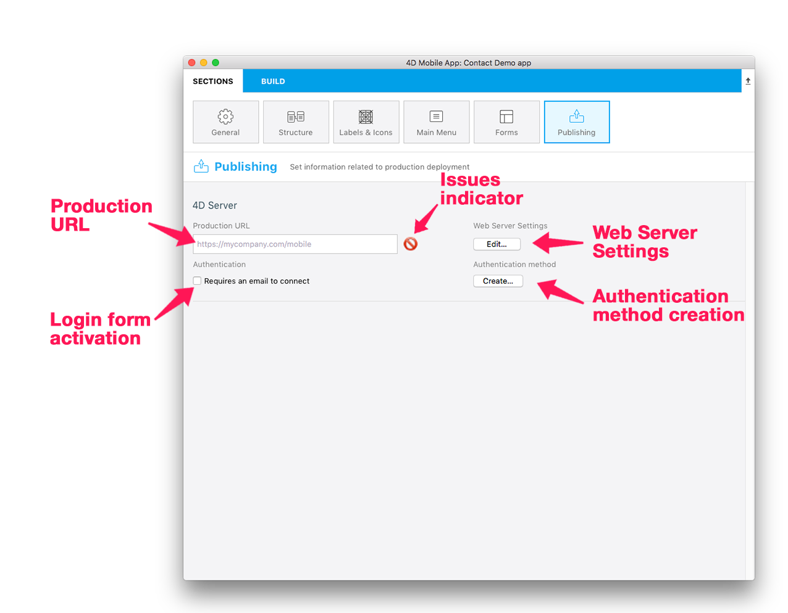
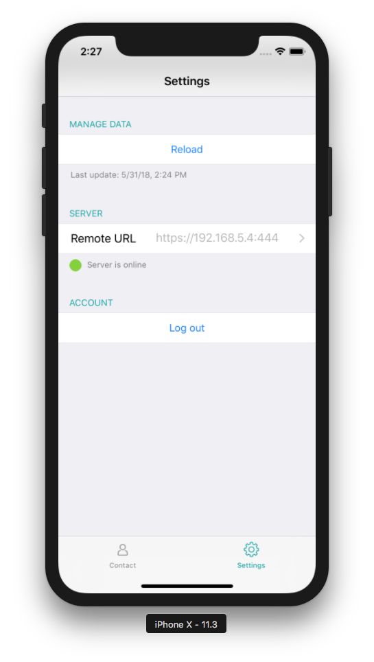
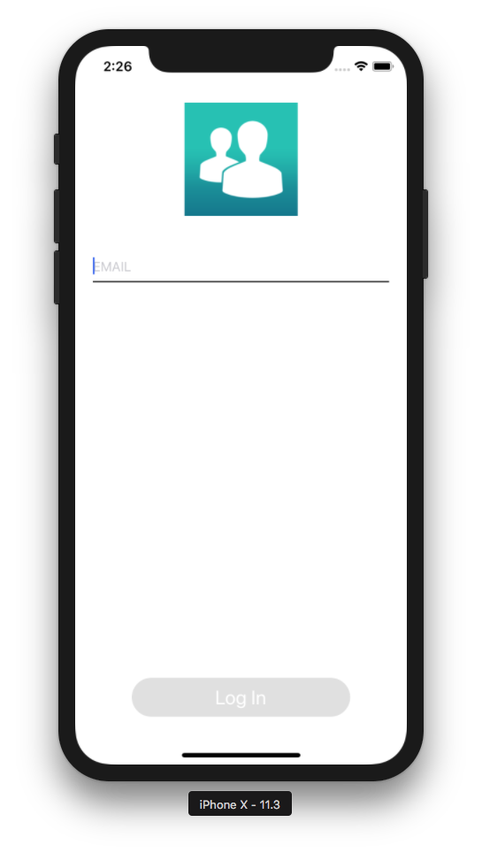

In this section you can :
* Define production URL
* Define Authentication mode guest or require an email when the app is launched
* Define Web server Settings
* Create and edit the On Mobile app authentication database method

## WEB SERVER SETTINGS
The communication between your app and the web server must be encrypted.

* The first thing you need to do is to activate and define your https port if it has not been defined yet. Click on the edit "Web Server Settings" button to do so.

* Activate the https port implies certificates installation to work properly. You can also create certificates with 4D but only for test purpose.

<b>TIPS:</b>

If the https is not properly defined or if certificates are missing the project editor will disply an issues indicator with a tip that indicates the nature for the issue.

## AUTHENTICATION MODE

Just check the "Requires an email to connect" checkbox to display a login form when the application starts

Else leave the box unchecked if you want the app to be in guest mode (no login form will appear when the application starts)

## DEFINE YOUR AUTHENTICATION METHOD

* For developement purpose, the authentication method allows you to use the app in localhost 
* For deployement purpose, you must create/edit your Authentication method to authorize specific emails, devices even if you are in guest mode.

A template is already available in the created Database method 
* to grant access for example email to specific domain 
* to get all the informations you need about the session as weel as user informations including the email, app informations, device and team ID...

You can customize this method according to your needs and goals ! 

## HOW IT LOOKS IN THE IOS APP

A Setting screen is available from the Tab bar or from a "More" Tab if there is more than 4 tables in your app.

If the "Requires an email to connect" option has been checked, then a login view appears when the app start and a logout button is available in the setting screen

