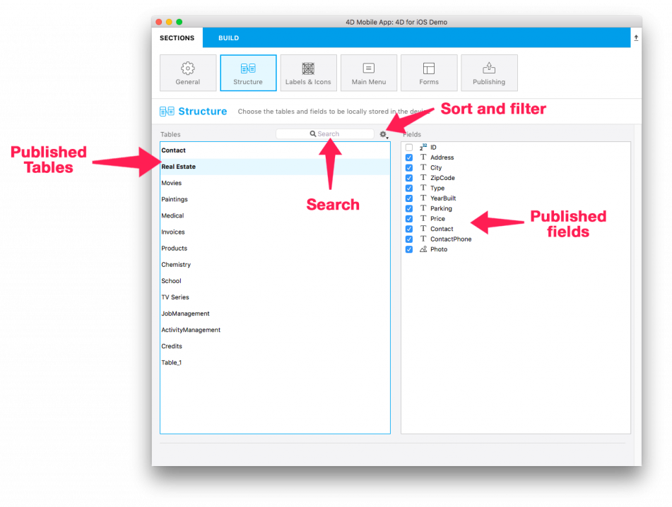

This section displays all of your database tables and fields exposed with 4D Mobile.

Here, you can define a subset of your physical structure to replicate for mobile devices by selecting specific tables and fields. The selected:

* tables will be automatically added to the tab bar of your application.
* fields will be available later when it's time to define your list and detail forms.
 

To help you define your application structure, filters and a search engine are available to make your table and field selections easy.

<b>TIP:</b>

You can publish a selection of fields by pressing the spacebar rather than selecting them one by one.

