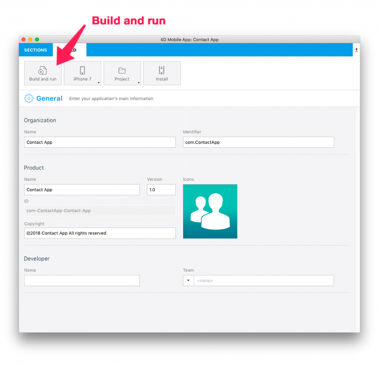
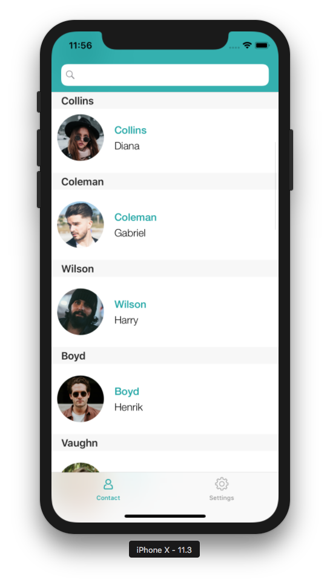

<b>OBJECTIVES</b>

* Test my application in the Simulator

Finished developing you application and want to test it?

## STEP 1. Select your device

* Go to the BUILD tab from the Project Editor and select the iOS device (aka the Simulator) to use to run your application.

## STEP 2. Build and Run

* Click on the Build and Run button.

## STEP 3. Test your App

* Test navigating between the list and the detail forms in your application.

 

