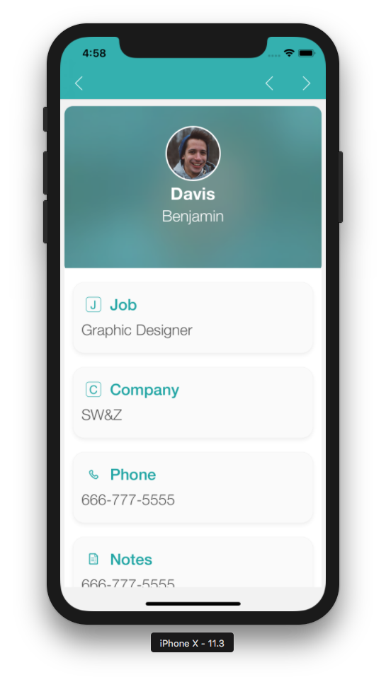

<b>OBJECTIVES</b>

* Test my application in the Simulator

<b>PREREQUISITES</b>

* Latest version of [Xcode](https://itunes.apple.com/us/app/xcode/id497799835) installed on your Mac.

Finished developing you application and want to test it?

## STEP 1. SELECT YOUR DEVICE

* Go to the BUILD tab from the Project Editor and select the iOS device (aka the Simulator) to use to run your application.

## STEP 2. BUILD AND RUN 

* Click on the Build and Run button.

## STEP 3. TEST YOUR APPLICATION

* Test navigating between the list and the detail forms in your application.

 

