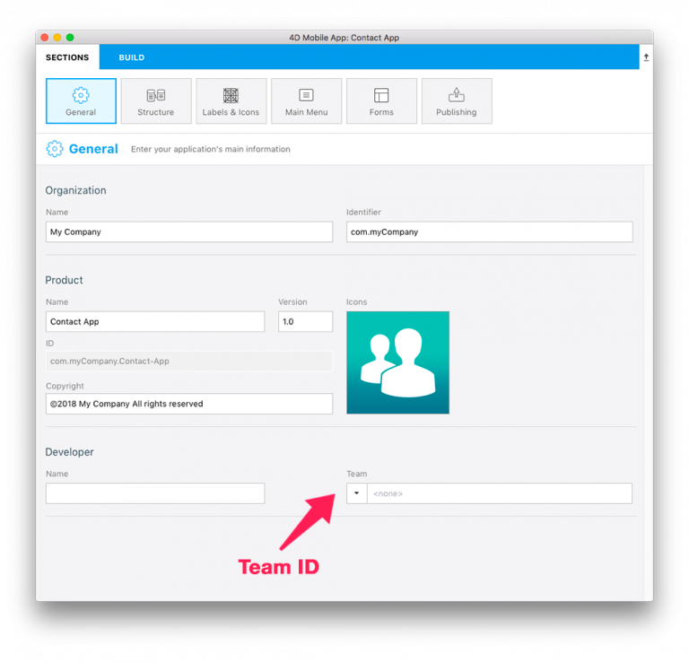

<b>OBJECTIVES</b>

* install my App on a connected device

<b>PREREQUISITES</b>

* Apple Developer Program for App Store deployment ($99) or Apple Enterprise Developer Program for in-house deployment ($299)
* Last [Xcode](https://itunes.apple.com/us/app/xcode/id497799835) version installed on your Mac.
* [Apple configurator 2](https://itunes.apple.com/us/app/apple-configurator-2/id1037126344) installed on your Mac.

If you want to publish your app, the first step is to create an Apple Developer Program.

Depending on your objectives and preferences you can decide to create an Apple Developer Program for individual or organization for an App Store Deployment or an Apple Enterprise Developer Program if you choose to deploy your app in-house.

Let us start from the beginning

## STEP 1. ACCOUNT CREATION – ONLY THE FIRST TIME

* Apple ID : to create your apple ID, if you don’t have one yet click [here](https://itunes.apple.com/us/app/xcode/id497799835)  

* Developer Account : Choose an Apple developer program for organisations or for individuals for App Store deployment or Apple developer Enterprise program for in-house deployment.
* Install Xcode : go to the App Store, download and install [Xcode](https://itunes.apple.com/us/app/xcode/id497799835) and open it to install all component
* Install Apple Configurator 2 : go to App Store, download and install [Apple configurator 2](https://itunes.apple.com/us/app/apple-configurator-2/id1037126344) 

## STEP 2. XCODE CONFIGURATION – ONLY THE FIRST TIME

* GO to Xcode > Preferences > Accounts and add your developer account
 

* Team ID : Go to your developer account > Membership and get your Team ID
 

* 4D for iOS : launch 4D for iOS under the General Section and fill your Team ID
 

## STEP 3. XCODE CONFIGURATION – ONLY THE FIRST TIME

* When your app is ready, go to BUILD tab
* Connect your device to your computer using a USB cable
* From the BUILD tab click on Install Button

 

* Wait for the app to be installed on your device
