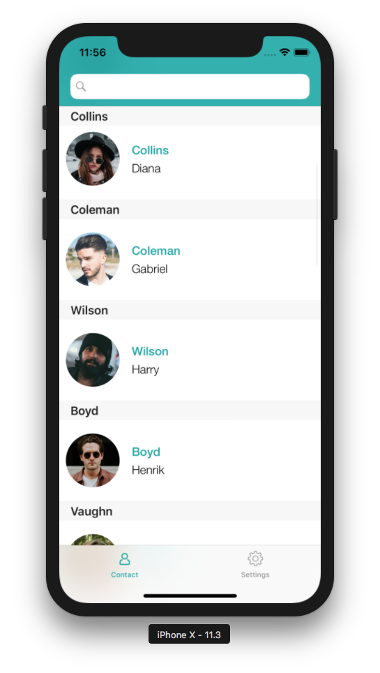

<b>OBJECTIVES</b>

* Test my application in the simulator

<b>PREREQUISITES</b>

* Last [Xcode](https://itunes.apple.com/us/app/xcode/id497799835) version installed on your Mac.

Your app is ready and you want to test your app ?

## STEP 1. SELECT YOUR DEVICE

* Go to BUILD tab from the project editor
* Select the iOS device you want to run your app on

## STEP 2. BUILD AND RUN 

* Click on Build and Run button

## STEP 3. TEST YOUR APP

* Test your app navigating between the list Form and the detail Form

 

